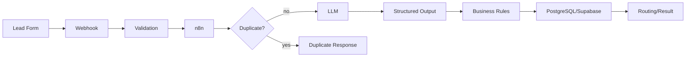
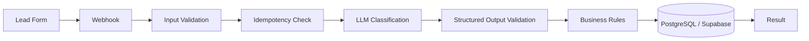

# AI Lead Qualification Automation

An independent proof-of-concept portfolio case study that automates the first
layer of B2B lead qualification with a realistic, maintainable stack:
**n8n + LLM structured output + PostgreSQL/Supabase**.

This is a demo. It has no real client, no production credentials, and no real
personal data. All fixtures are synthetic.

## Problem

Manual lead review is the default in many small B2B teams. That process:

- delays first response to high-intent leads;
- produces inconsistent qualification decisions between reviewers;
- makes it hard to prioritize dozens of similar form submissions;
- forces salespeople to spend time triaging instead of selling.

## Solution

The project models a commercial lead-intake pipeline:



Every inbound submission is validated before it reaches the LLM. The LLM
returns a strict schema, not free text. Business rules add deterministic
guardrails, and Supabase stores a unique lead per `submission_id`.

## Architecture



See [docs/ARCHITECTURE.md](docs/ARCHITECTURE.md) for the responsibility of
each component.

## Key Features

- Webhook-based intake
- Input validation before any model call
- Structured LLM classification with JSON Schema
- Lead scoring and priority normalization
- Two-layer idempotency (`submission_id` workflow check + unique constraint)
- PostgreSQL/Supabase persistence
- Predictable duplicate responses
- Native n8n HTTP Request node for the LLM call
- `workflow_errors` table as a future logging scaffold
- Synthetic test fixtures and offline unit tests
- Minimal static HTML/JS demo form

## Reliability

The demo intentionally does more than demonstrate a happy path.

- **Input validation** rejects invalid payloads before they can reach the LLM.
- **Structured output validation** prevents corrupt classifications from being
  persisted as successful leads.
- **Duplicate protection** is applied in the workflow and enforced by a
  database `UNIQUE` constraint.
- **HTTP error handling** is explicit: the exported n8n workflow does not
  configure generic `retryOnFail`. HTTP failures stop the workflow so a 401 is
  not blindly retried as if it were transient.
- **Structured output validation** runs after the HTTP response. Invalid
  output fails the workflow and is never persisted as a successful lead.
- **Failure logging** has a `workflow_errors` scaffold table. Automatic
  persistent error insertion is not wired in this PoC; see the limitations.

The testable `src/llm.js` reference implementation demonstrates a bounded
retry strategy for transient failures, but the exported n8n workflow does not
claim selective retry.

No enterprise observability infrastructure is required.

## Tech Stack

- [n8n](https://n8n.io/) for orchestration
- PostgreSQL / [Supabase](https://supabase.com/) for persistence
- OpenAI-compatible chat completions API with JSON Schema structured output
- Node.js built-in test runner for offline tests
- Static HTML/CSS/JS for the demo form

Deliberately avoided: LangChain, Docker, Redis, vector databases, multi-agent
frameworks, and microservices.

## Repository Structure

```text
.
├── README.md
├── .env.example
├── .gitignore
├── LICENSE
├── n8n/
│   └── lead-qualification-workflow.json
├── database/
│   └── schema.sql
├── demo/
│   ├── index.html
│   └── config.example.js
├── docs/
│   ├── ARCHITECTURE.md
│   ├── TESTING.md
│   └── TROUBLESHOOTING.md
├── scripts/
│   └── generate-n8n-workflow.js
├── src/
│   ├── business-rules.js
│   ├── classification.js
│   ├── index.js
│   ├── llm.js
│   ├── pipeline.js
│   ├── response.js
│   ├── validation.js
│   └── webhook.js
├── tests/
│   ├── fixtures/
│   └── *.test.js
├── POST_AUDIT_FIX_REPORT.md
├── FINAL_PROJECT_STATUS.md
└── assets/
```

## Running the Demo

### 1. Prepare the database

Run [database/schema.sql](database/schema.sql) in the Supabase SQL editor or
with `psql`. It creates `leads` and `workflow_errors`.

### 2. Configure environment variables

Copy [.env.example](.env.example) to `.env` and fill in placeholders:

```bash
cp .env.example .env
```

Important Supabase note: the REST calls run inside n8n on the server side. Use
the `service_role` key as a server-side environment variable. Never put the
`service_role` key in a browser or in the exported workflow.

### 3. Import the n8n workflow

1. Start n8n.
2. Import
   [n8n/lead-qualification-workflow.json](n8n/lead-qualification-workflow.json).
3. Set the environment variables used by the workflow:
   - `LLM_API_BASE_URL`
   - `LLM_API_KEY`
   - `LLM_MODEL`
   - `LLM_STRUCTURED_OUTPUT_MODE`
   - `SUPABASE_URL`
   - `SUPABASE_SERVICE_ROLE_KEY`
4. Activate the workflow.
5. Confirm the webhook path is `/webhook/lead-qualification`.

The workflow uses `$env` in HTTP Request nodes and a local `getEnv()` fallback
in Code nodes, so credentials remain outside the workflow file. Timeout values
are configured on the native HTTP Request node. If your n8n
version restricts environment-variable access inside Code nodes, either allow
that access in n8n or map the Code-node values (`LLM_MODEL`,
`LLM_STRUCTURED_OUTPUT_MODE`) with the same n8n-supported expression/credential
mechanism. No secrets are hardcoded.

### 4. Run the demo form

```bash
cp demo/config.example.js demo/config.js
```

Edit `demo/config.js` and set `webhookUrl` to your n8n webhook URL, then open
`demo/index.html` in a browser.

## Testing

Automated tests use only Node.js built-ins and do not call a real LLM:

```bash
npm test
```

Expected local result: all tests pass. See
[docs/TESTING.md](docs/TESTING.md) for E2E test instructions.

## Security

- No real API keys, database credentials, or secrets are committed.
- No Supabase `service_role` key is used in the browser; it is referenced only
  as a server-side n8n environment variable.
- No real personal data is present; all fixtures are synthetic.
- Secrets are loaded from environment variables or an n8n credential store.
- `.env` and `demo/config.js` are ignored by Git.
- The LLM prompt omits the lead's email address.
- Supabase RLS is enabled with deny-by-default for `anon` and `authenticated`;
  server-side `service_role` is used only by n8n.

## Project Status

Independent proof of concept / portfolio case study. No numerical business
results are claimed because no production traffic has been measured. The
offline/n8n/live validation boundary is recorded in
[FINAL_PROJECT_STATUS.md](FINAL_PROJECT_STATUS.md).

## License

[MIT](LICENSE)
