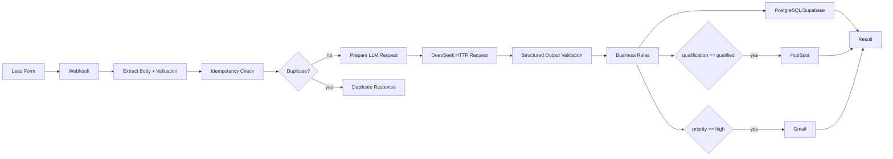

# Architecture

## Overview

The system is a single, easy-to-follow intake pipeline:



The design favors simplicity, readability, maintenance, and a commercially
plausible architecture. It avoids microservices and infrastructure that a
portfolio demo does not need.

## Component responsibilities

### Form

The static demo form is the entry point. It generates a
`submission_id` with `crypto.randomUUID()` when available and posts a
JSON payload to the n8n webhook.

### Webhook

Receives the HTTP POST request. The webhook path is
`/webhook/lead-qualification`. Its response is produced by the final node in
the workflow.

### n8n

n8n orchestrates the pipeline:

`Webhook -> Validate Input -> Check Duplicate -> Merge Check + Input ->
Evaluate Duplicate -> Is Duplicate? -> Prepare LLM Request -> DeepSeek HTTP Request
-> Merge LLM + Lead -> Validate Structured Output -> Apply Business Rules ->
Persist Lead -> Merge Persist + Record -> Respond`

After business rules:

- `If` routes `qualification == qualified` to HubSpot
  `Create or update a contact`.
- `If1` routes `priority == high` to Gmail `Send a message`.

### LLM

DeepSeek performs semantic classification only. It receives a normalized lead
payload and returns a strict JSON object:

```json
{
  "intent": "sales",
  "service": "ai_automation",
  "qualification": "qualified",
  "priority": "high",
  "lead_score": 88,
  "human_review": false,
  "qualification_reason": "Clear budget and stated automation need.",
  "summary": "Acme needs sales process automation."
}
```

The prompt explicitly forbids chain-of-thought and markdown fences.

### HubSpot CRM

Qualified leads are upserted as contacts with name, email, and company.

### Gmail

High-priority leads trigger a synthetic high-priority notification.

### Structured Output

The LLM response is parsed and validated against a predictable contract.
Invalid structured output fails the workflow and is never persisted as
success. The exported workflow does not configure automatic retry for HTTP
failures; a 401 is therefore not blindly retried as if it were transient.
The offline `src/llm.js` reference implementation demonstrates a bounded
retry strategy for transient errors.

### PostgreSQL / Supabase

Persistence is handled by two tables:

- `leads` stores one qualified or reviewed lead per unique `submission_id`.
- `workflow_errors` is a scaffold/future extension for failure records. It is
  not automatically populated by the current workflow.

The `leads.submission_id` column has a `UNIQUE` constraint as the database
layer of idempotency.

### Idempotency

Two layers protect against duplicate effects:

1. The workflow checks Supabase before calling the LLM.
2. The database has a `UNIQUE` constraint on `submission_id`.
3. The persist call uses `on_conflict=submission_id` and
   `resolution=ignore-duplicates`, so a race cannot create two rows.

The persisted request uses `resolution=ignore-duplicates` as a final guard.

### Error Handling

The exported workflow does not configure automatic retry. Invalid input,
invalid structured output, HTTP 401, HTTP 429, HTTP 5xx, timeouts, and
schema/constraint failures stop the workflow and are surfaced by n8n rather
than being persisted as success.

`workflow_errors` is a scaffold/future extension. Automatic workflow error
persistence is not implemented.

## Key tradeoffs

- The n8n Code nodes duplicate selected validation/normalization/response logic
  from `src/` so the workflow remains self-contained and importable. The
  `src/` version is the tested source of truth.
- Supabase REST is used for the n8n workflow because it is easy to configure
  with n8n credentials and avoids embedding database credentials in the
  workflow export. The workflow uses a server-side Supabase credential; the
  browser demo never sees a database key.
- JavaScript is limited to extraction/validation, structured-output handling,
  business rules, and response handling. HTTP calls are native n8n HTTP
  Request nodes, not `fetch()` inside Code nodes.
- The live workflow uses n8n credential connections for DeepSeek, Supabase,
  HubSpot, and Gmail. The public export removes all credential bindings.
